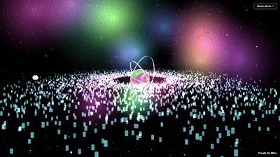

<!-- Banner -->

  

<h1 align="center">🌌 Galaxy-Love 💫</h1>

  <i>A cosmic journey that blends stardust & code — explore, interact, and fall in love with the galaxy.</i>

  
  
  
  

---

## 🚀 Live Preview

   

---

## ✨ Features
- 🌠 **Interactive Galactic Animation** — stars move & twinkle in real-time  
- 💖 **Romantic Space Vibes** — cosmic colors with a touch of love  
- 📱 **Responsive Design** — looks perfect on any device  
- ⚡ **Lightweight & Fast** — no heavy dependencies  

---

## 🛠️ Tech Stack
| Technology | Purpose |
|------------|---------|
| **HTML5**  | Structure |
| **CSS3**   | Styling & animations |
| **JavaScript** | Interactivity & effects |
